### *I'm using the Learner Lab*

### 1.3 Connect to AWS using the CLI
- install AWS CLI
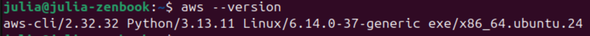

- start lab -> connect to AWS using CLI
(important to update the '~/.aws/credentials' file with new credentials if the current session expires)
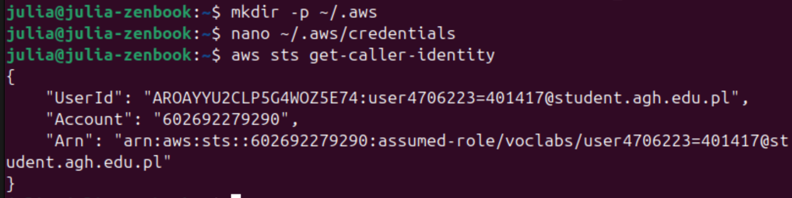

### 2. Amazon S3 setup and file management
- open Console Home -> storage -> create an S3 bucket
    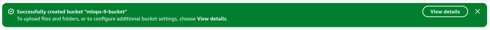

- download model

- upload to S3 (used the AWS S3 console)
    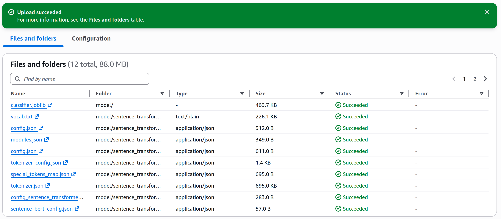

- delete models from "models" directory in the app from Lab 1

- add S3 files download script `s3_artifacts.py`:
    ```python
    import boto3
    import os

    # create an S3 resource object
    s3 = boto3.resource("s3") # assumes credentials & configuration are handled outside python in .aws directory or environment variables

    BUCKET_NAME = "mlops-9-bucket"
    S3_MODELS_PREFIX = "model/"
    LOCAL_MODELS_DIR = "model"


    def download_models_from_s3():
        # don't download if models are present
        if os.path.exists(LOCAL_MODELS_DIR) and os.listdir(LOCAL_MODELS_DIR):
            return

        bucket = s3.Bucket(BUCKET_NAME) # get a handle to the S3 bucket

        for obj in bucket.objects.filter(Prefix=S3_MODELS_PREFIX):
            # keep the same structure locally
            local_path = obj.key
            os.makedirs(os.path.dirname(local_path), exist_ok=True)

            bucket.download_file(obj.key, local_path)
    ```
- check if app works:
    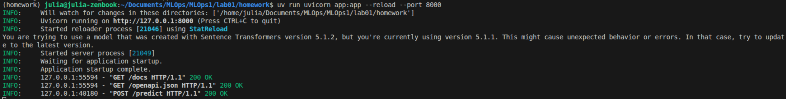

- see preview in FastApi
    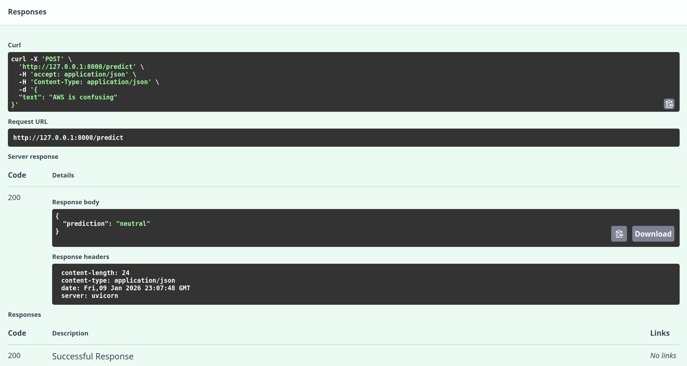

### 3. Elastic Container Registry (ECR) & Docker management
*"It provides secure, scalable storage for your Docker images, tightly integrated with other AWS services."*

- create the ECR
    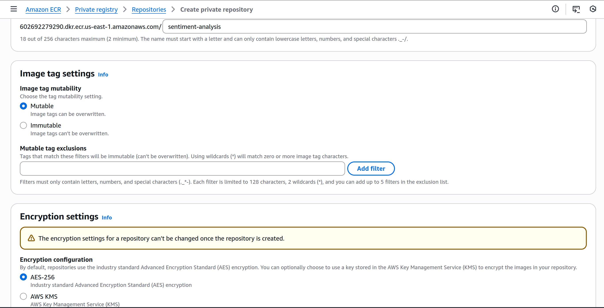
    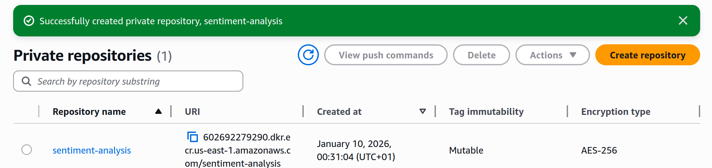

- authenticate Docker client to ECR
    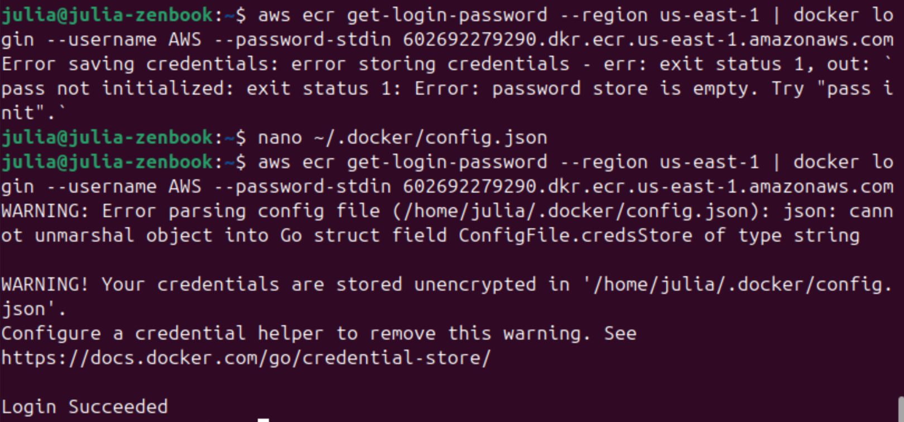
    ***Comment:** Docker authentication to ECR initially failed due to an uninitialised pass credential store. I disabled credential storage locally and authentication then succeeded. Credential helper setup was skipped for simplicity, as this is a local lab environment.*

- build the app Docker image
    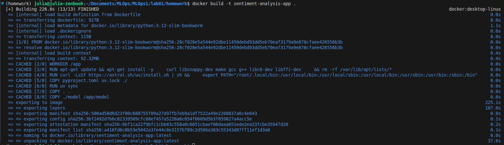

- tag it with the ECR URI and push to the ECR repo
    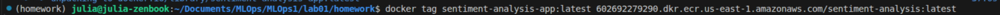
    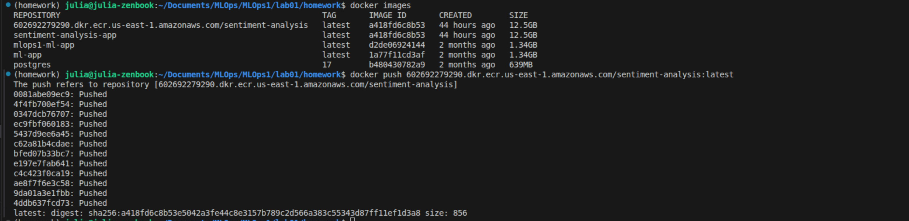


### 4. Virtual Private Cloud (VPC) configuration

- create a new VPC
    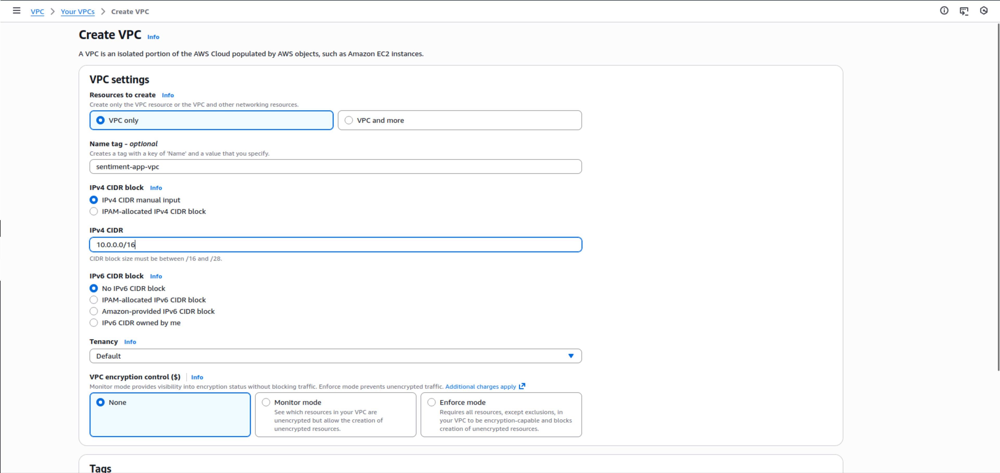
    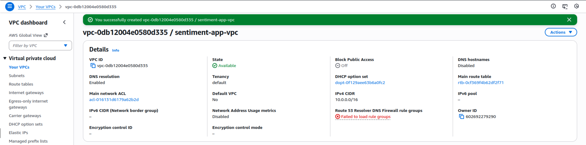

- create public and private subnets in different AZs
    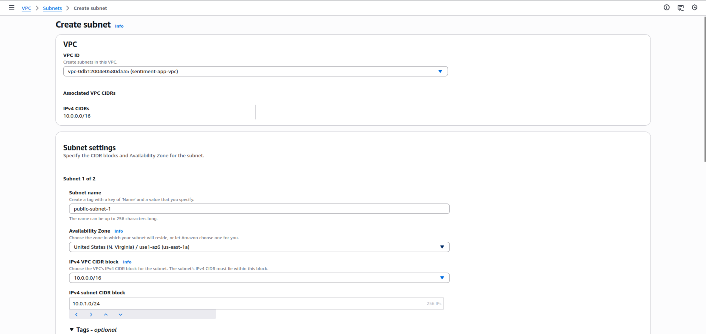
    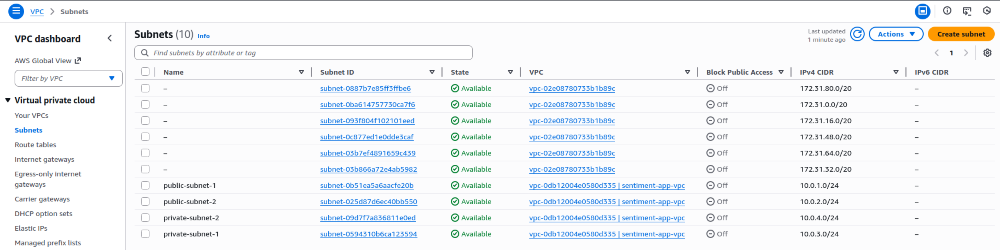

- set up an Internet Gateway
    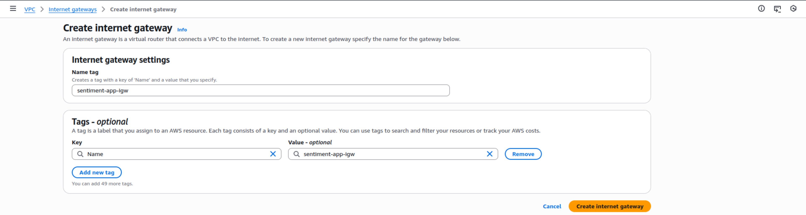
    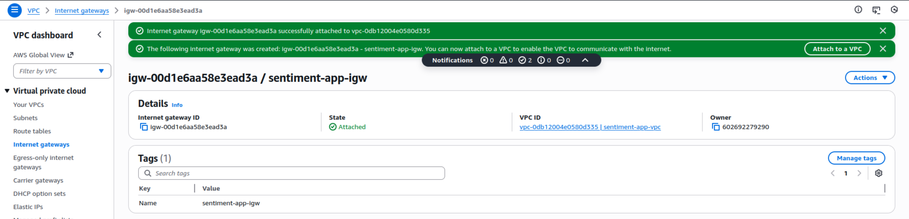

- configure route tables
    "Public route tables enable external communication for public subnets, while private route tables keep backend resources isolated."
    - the public route table
        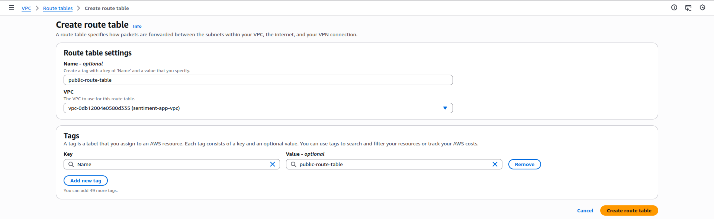
        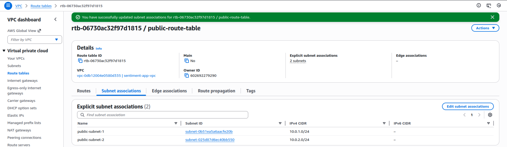
        - add a route to allow interner access
            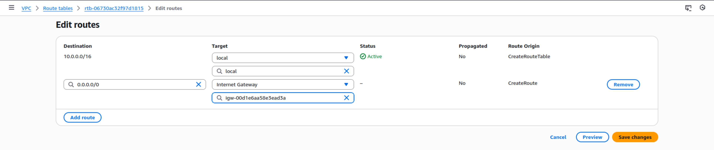

    - the private route table
        

- set up a NAT Gateway
    "NAT Gateway allows instances in private subnets to access the internet without exposing them to inbound traffic."
        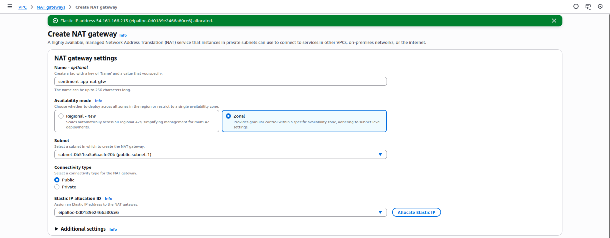
        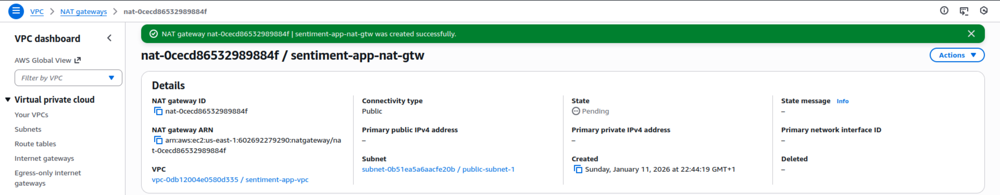

    - Update the private route table to route internet-bound traffic through the NAT Gateway:
        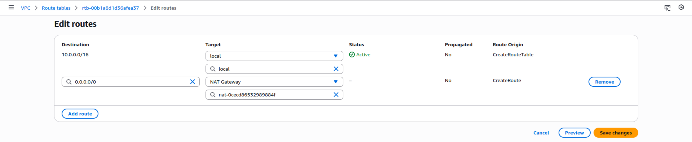
        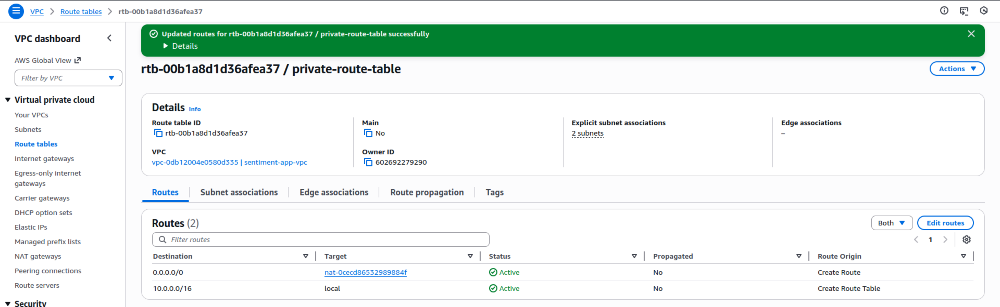

- create Security Groups
    - App Load Balancer SG
        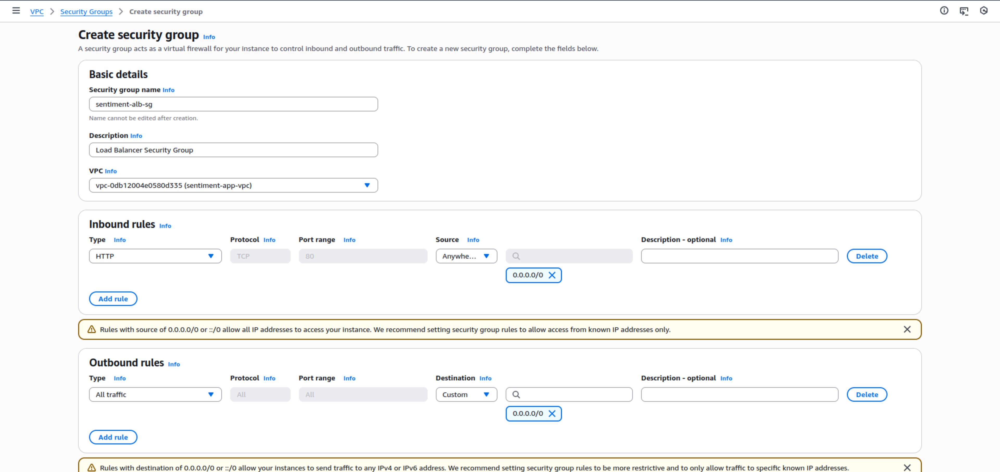
    - Resources SG
        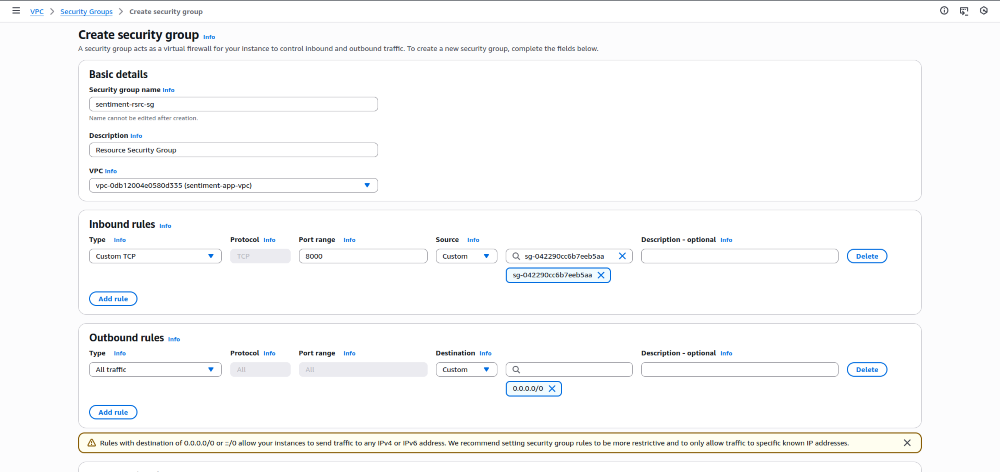      

    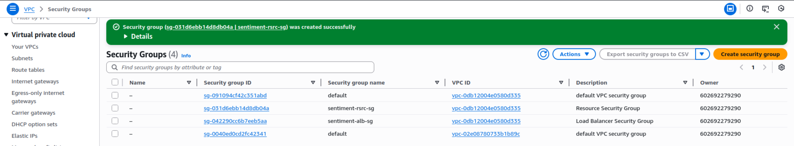   

- set up an Application Load Balancer (ALB)
    "Application Load Balancer (ALB) distributes incoming traffic across multiple targets to avoid overloading a single instance with traffic, which minimizes latency and maximizes throughput."
