### *I'm using the Learner Lab*

### 1.3 Connect to AWS using the CLI
- install AWS CLI


- start lab -> connect to AWS using CLI
(important to update the '~/.aws/credentials' file with new credentials if the current session expires)


### 2. Amazon S3 setup and file management
- open Console Home -> storage -> create an S3 bucket
    

- download model

- upload to S3 (used the AWS S3 console)
    

- delete models from "models" directory in the app from Lab 1

- add S3 files download script `s3_artifacts.py`:
    ```python
    import boto3
    import os

    # create an S3 resource object
    s3 = boto3.resource("s3") # assumes credentials & configuration are handled outside python in .aws directory or environment variables

    BUCKET_NAME = "mlops-9-bucket"
    S3_MODELS_PREFIX = "model/"
    LOCAL_MODELS_DIR = "model"


    def download_models_from_s3():
        # don't download if models are present
        if os.path.exists(LOCAL_MODELS_DIR) and os.listdir(LOCAL_MODELS_DIR):
            return

        bucket = s3.Bucket(BUCKET_NAME) # get a handle to the S3 bucket

        for obj in bucket.objects.filter(Prefix=S3_MODELS_PREFIX):
            # keep the same structure locally
            local_path = obj.key
            os.makedirs(os.path.dirname(local_path), exist_ok=True)

            bucket.download_file(obj.key, local_path)
    ```
- check if app works:
    

- see preview in FastApi
    

### 3. Elastic Container Registry (ECR) & Docker management
*"It provides secure, scalable storage for your Docker images, tightly integrated with other AWS services."*

- create the ECR
    
    

- authenticate Docker client to ECR
    
    ***Comment:** Docker authentication to ECR initially failed due to an uninitialised pass credential store. I disabled credential storage locally and authentication then succeeded. Credential helper setup was skipped for simplicity, as this is a local lab environment.*

- build the app Docker image
    

- tag it with the ECR URI and push to the ECR repo
    
    


### 4. Virtual Private Cloud (VPC) configuration
A private network in AWS that orchestrates the traffic.
- create a new VPC
    
    

- create public and private subnets in different AZs
    
    

- set up an Internet Gateway
    
    

- configure route tables
    "Public route tables enable external communication for public subnets, while private route tables keep backend resources isolated."
    - the public route table
        
        
        - add a route to allow interner access
            

    - the private route table
        

- set up a NAT Gateway
    "NAT Gateway allows instances in private subnets to access the internet '(e.g. to pull images, call APIs)' without exposing them to inbound traffic."
        
        

    - Update the private route table to route internet-bound traffic through the NAT Gateway:
        
        

- create Security Groups
    - App Load Balancer SG
        
    - Resources SG
              

       

- set up an Application Load Balancer (ALB)
    "Application Load Balancer (ALB) distributes incoming traffic across multiple targets to avoid overloading a single instance with traffic, which minimizes latency and maximizes throughput."

    - Target Group
    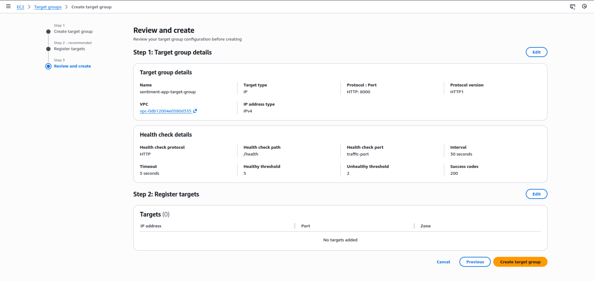

    - Application Load Balancer
    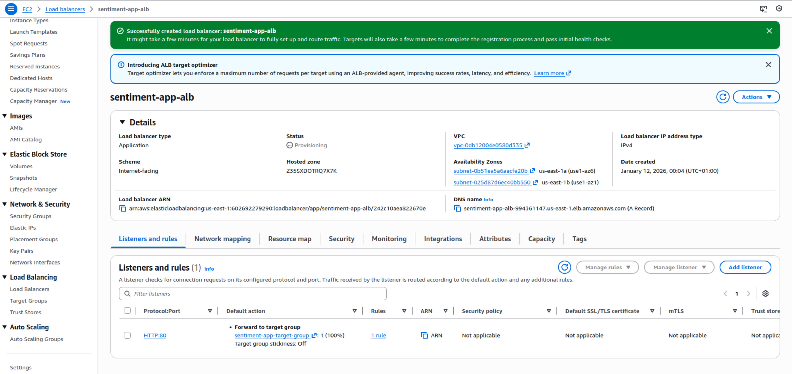
    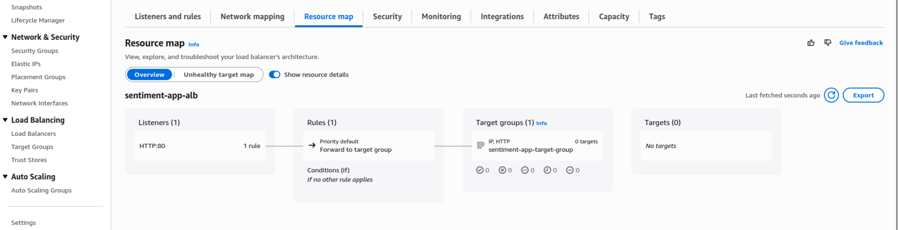
    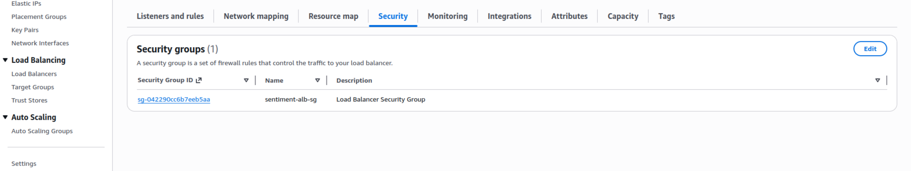

### 5. AWS Fargate deployment & CloudWatch configuration
#### 5.1 Create an ECS Cluster
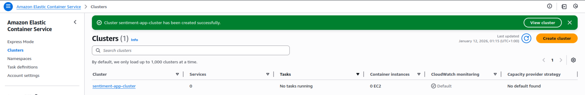

#### 5.2 Create a Task Definition
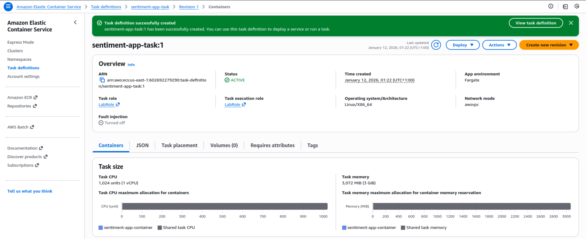
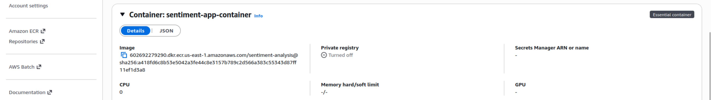

#### 5.3 Create a Service
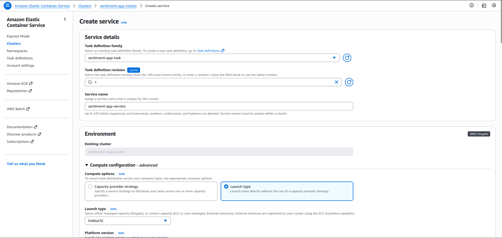
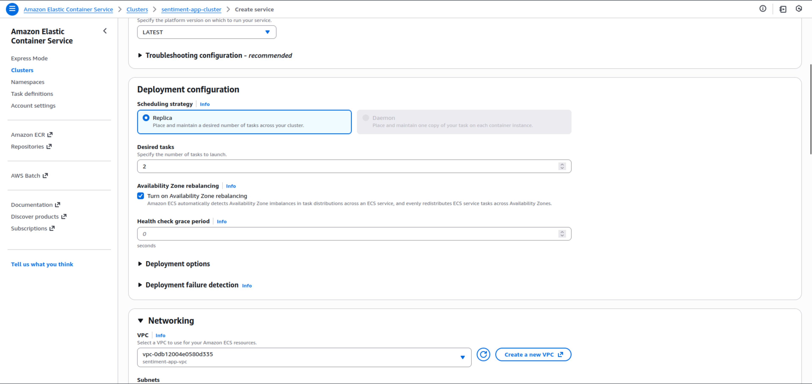


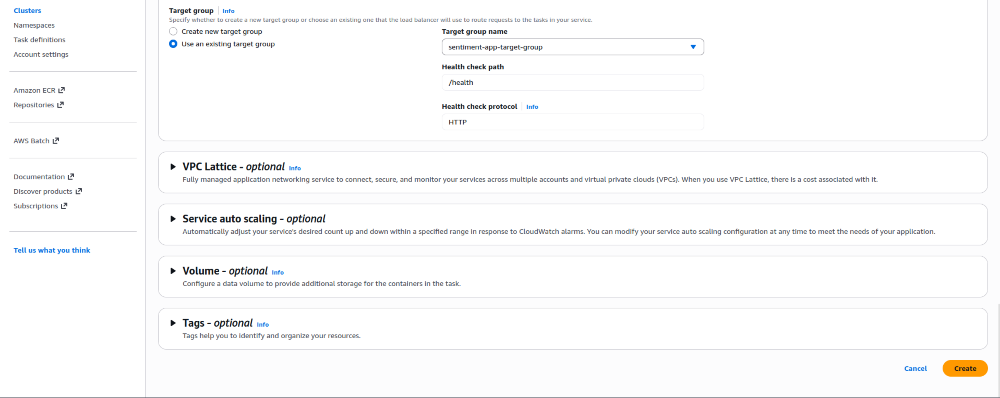
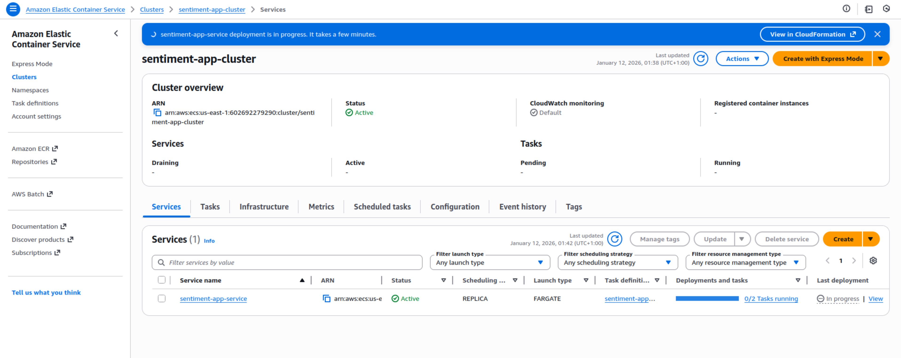

#### 5.4 Running the service

### It didn't work :) - Lessons learnt:
- so for some reason I didn't check if the Docker image worked locally... 
- it failed, which was hard to find in AWS
- turns out I was using the `python:3.12-slim-bookworm` base image but didn't update the lock file and the .python-version file to match the python version of that image
- after setting `requires-python = ">=3.12"` in `pyproject.toml` and rebuilding the Docker image, I checked if it works locally, and it did, so I tagged it and pushed again to ECR, and then updated the Task Definition and ECS Service to use that task definition and forced deployment
- then it run, said the app is running, but it wasn't reachable from the ALB's DNS "503 Service Unavailable"
- apparently when the lab said to "Availability Zones: Select the VPC created earlier and both public subnets." all AZs were supposed to be checked (both where private and public subnets were), fixed that and the app FINALLY loaded properly

#### Let's continue
- checking Tasks logs
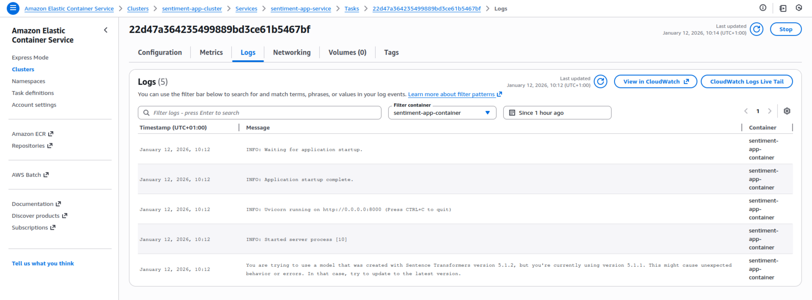

#### 6. Application testing and monitoring
6.1 Test the application
- Load Balancer DNS name in a web browser, enter sample text and check if the app works
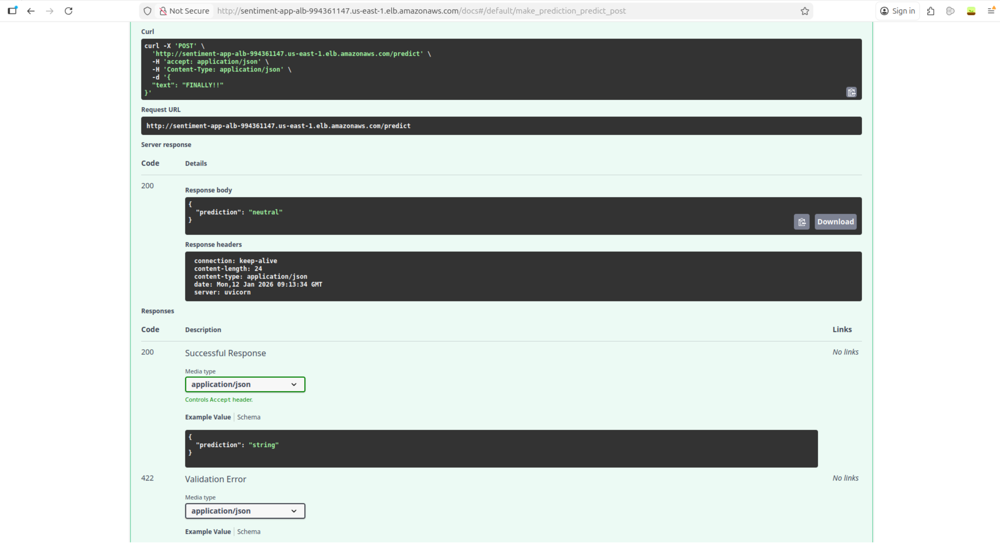

- or a simple test script
    ```
    import requests

    BASE_URL = "http://sentiment-app-alb-994361147.us-east-1.elb.amazonaws.com"

    response = requests.post(
        f"{BASE_URL}/predict",
        json={"text": "This lab maybe took a while but aws was tough"}
    )

    print("Status code:", response.status_code)
    print("Response:", response.json())

    assert response.status_code == 200
    assert "prediction" in response.json()
    ```
    which results in a pass
    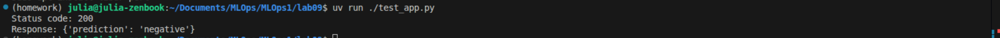

- CloudWatch - the basic monitoring service at AWS
    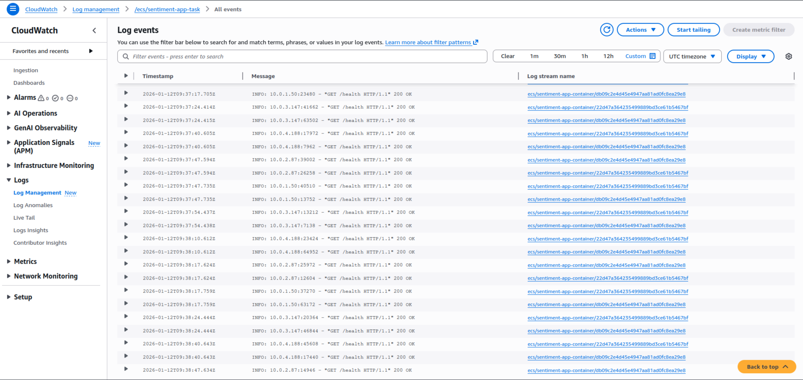
    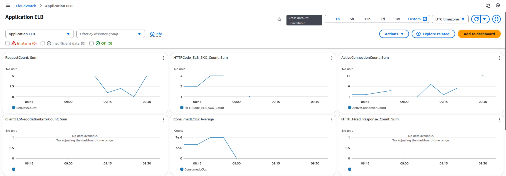
    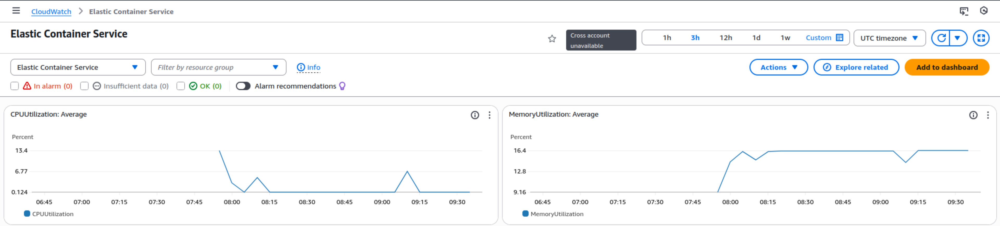
